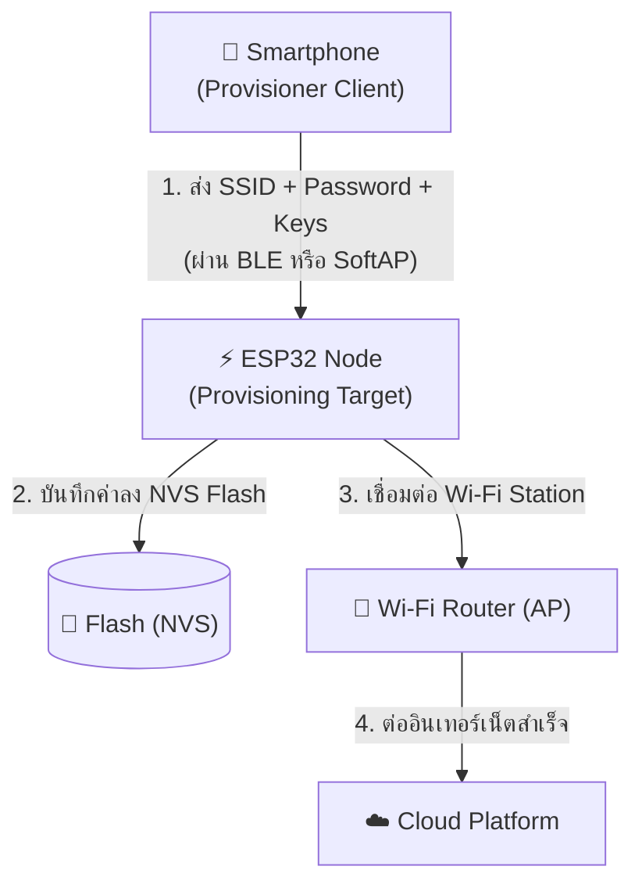
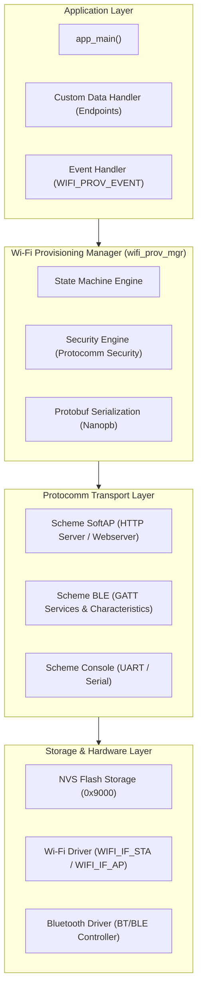
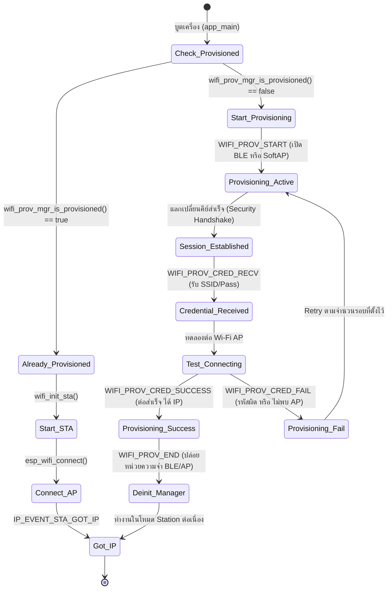

# 01 Wi-Fi Provisioning Architecture & Protocomm Subsystem

## 1. ปัญหาของอุปกรณ์ IoT Headless (The Headless IoT Problem)

อุปกรณ์ IoT ส่วนใหญ่ในท้องตลาด (เช่น หลอดไฟอัจฉริยะ, ปลั๊กไฟ, เซนเซอร์ตรวจวัดสภาพอากาศ, กล้องวงจรปิด) เป็นอุปกรณ์ประเภท **"Headless Devices"** กล่าวคือ **ไม่มีจอแสดงผล (Display) และไม่มีคีย์บอร์ด (Input Keyboard)**

เมื่อผู้ใช้นำอุปกรณ์ออกจากกล่อง (Out-of-the-Box Experience: OOBE) อุปกรณ์จะต้องทำการเชื่อมต่อเข้าสู่ Home Wi-Fi Router เพื่อออกสู่อินเทอร์เน็ต แต่คำถามสำคัญคือ
> *"อุปกรณ์ IoT จะรู้ชื่อเครือข่าย (SSID) และรหัสผ่าน (Password) ได้อย่างไร หากผู้ใช้ไม่สามารถพิมพ์ใส่เข้าไปโดยตรง?"*

กระบวนการส่งมอบข้อมูลคอนฟิกเครือข่ายไร้สายจากอุปกรณ์ตัวกลาง (Provisioning Client เช่น Smartphone หรือ PC) ไปยังอุปกรณ์ IoT (Provisioning Target หรือ Node) เรียกว่า **Wi-Fi Provisioning**



---

## 2. สถาปัตยกรรม Provisioning Subsystem ใน ESP-IDF

ESP-IDF ออกแบบโมดูล Wi-Fi Provisioning ให้เป็นแบบ **Modular & Layered Architecture** แบ่งการทำงานออกเป็น 3 เลเยอร์หลัก:



### องค์ประกอบสำคัญ:
1. **`wifi_prov_mgr` (Provisioning Manager)** ควบคุม State Machine ตั้งแต่เริ่มต้น จนกระทั่งเชื่อมต่อ Wi-Fi สำเร็จ และทำการคืนหน่วยความจำ (De-initialization)
2. **`protocomm` (Protocol Communication)** ชั้นการสื่อสารแบบนามธรรม (Transport Agnostic) ที่ทำหน้าที่จัดการดังต่อไปนี้
   - **Endpoint Registration** (การสร้างช่องทางรับส่งข้อมูล)
   - **Security Handshake & Encryption** (การเข้ารหัสข้อมูล)
   - **Message Framing** (การจัดรูปแบบข้อมูล)
1. **`nanopb` (Protocol Buffers)** ใช้สำหรับ Encode/Decode ข้อมูลโครงสร้าง (Structured Data) เป็นไบนารีขนาดกะทัดรัด ประหยัด Bandwidth และหน่วยความจำ RAM ของไมโครคอนโทรลเลอร์

---

## 3. Provisioning Endpoints มาตรฐาน

ในระบบ Protocomm ข้อมูลจะถูกส่งผ่านช่องทางที่เรียกว่า **Endpoint** ซึ่งแต่ละ Endpoint จะมีหน้าที่เฉพาะเจาะจง ดังตารางด้านล่างนี้

| Endpoint Name              | วัตถุประสงค์                     | รายละเอียดข้อมูล                                                      |
| :------------------------- | :------------------------------- | :-------------------------------------------------------------------- |
| `prov-session`             | สร้างและเจรจา Security Session   | ทำการแลกเปลี่ยน Key (ECDH/X25519) และตรวจสอบสิทธิ์ (PoP / SRP6a)      |
| `prov-config`              | ส่งมอบข้อมูล Wi-Fi Configuration | ส่งชื่อ SSID, Password, BSSID และคำสั่งสั่งให้ ESP32 เริ่มเชื่อมต่อ   |
| `prov-scan`                | สแกนหาเครือข่าย Wi-Fi รอบตัว     | ESP32 ส่งรายชื่อ Wi-Fi AP ที่สแกนเจอและค่า RSSI กลับไปยังสมาร์ตโฟน    |
| `proto-ver`                | ตรวจสอบเวอร์ชันของโปรโตคอล       | ให้แอปพลิเคชันมือถือทราบว่า ESP32 รองรับความสามารถใดบ้าง              |
| `custom-data` *(Optional)* | ส่งข้อมูลเฉพาะของแอปพลิเคชัน     | เช่น Device Serial Number, MQTT Broker URL, Cloud Auth Token, User ID |

---

## 4. วงจรชีวิตของ Provisioning State Machine

ESP-IDF จัดการสถานะของ Provisioning ผ่าน State Machine ภายใน โดยส่งสัญญาณ Event แจ้งเตือนไปยัง Application ผ่าน Default Event Loop



### Event สำคัญที่ Application ต้องให้ความสำคัญ


| Event name               | ความสำคัญ                                                                 |
| ------------------------ | ------------------------------------------------------------------------- |
| `WIFI_PROV_START`        | ระบบ Provisioning เริ่มต้น กระจายสัญญาณ BLE หรือ SoftAP                   |
| `WIFI_PROV_CRED_RECV`    | บอกว่าได้รับข้อมูล SSID/Password จากสมาร์ตโฟนแล้ว                         |
| `WIFI_PROV_CRED_FAIL`    | ข้อมูล Wi-Fi ที่ส่งมาเชื่อมต่อไม่สำเร็จ (รหัสผ่านผิด หรือ ไม่พบสัญญาณ AP) |
| `WIFI_PROV_CRED_SUCCESS` | เชื่อมต่อ Wi-Fi สำเร็จ และบันทึกข้อมูลลง NVS Flash เรียบร้อย              |
| `WIFI_PROV_END`          | กระบวนการเสร็จสิ้น คืนหน่วยความจำ Bluetooth/SoftAP ให้ระบบใช้งานอื่น      |

---

## 5. การสร้าง Dynamic Device Service Name จาก MAC Address

เพื่อป้องกันไม่ให้อุปกรณ์ ESP32 หลายๆ ตัวที่เปิดใช้งานพร้อมกันในห้องเรียนมีชื่อซ้ำกัน  (โดยเฉพาะเมื่อทดลองในห้องเรียนพร้อมกันหลายๆ เครื่อง)
โปรเจกตัวอย่างของ ESP-IDF ที่ชื่อ `wifi_prov_mgr` มีฟังก์ชันสร้างชื่อ Device Name อัตโนมัติจาก MAC Address 3 ไบต์สุดท้าย

```c
static void get_device_service_name(char *service_name, size_t max)
{
    uint8_t eth_mac[6];
    const char *ssid_prefix = "PROV_";
    esp_wifi_get_mac(WIFI_IF_STA, eth_mac);
    // แปลง 3 ไบต์สุดท้ายของ MAC Address (เช่น 0E:D0:54 -> PROV_0ED054)
    snprintf(service_name, max, "%s%02X%02X%02X",
             ssid_prefix, eth_mac[3], eth_mac[4], eth_mac[5]);
}
```

* **เมื่อใช้ Scheme SoftAP** ชื่อนี้จะถูกใช้เป็น **Wi-Fi SSID**
* **เมื่อใช้ Scheme BLE** ชื่อนี้จะถูกใช้เป็น **BLE Device Name (Advertising Name)**

---

## 6. สรุป
Protocomm และ Provisioning Manager ทำให้อุปกรณ์ ESP32 สามารถรับการตั้งค่าเครือข่ายได้อย่างปลอดภัยและยืดหยุ่น 
โดยแยกแยะชั้นของ Transport (SoftAP/BLE), Security (Sec0/Sec1/Sec2), และ Application Endpoints ออกจากกันอย่างสมบูรณ์ 
ในหัวข้อถัดไปเราจะมาเจาะลึกความแตกต่างระหว่างช่องทางการสื่อสารทั้งสองรูปแบบ
