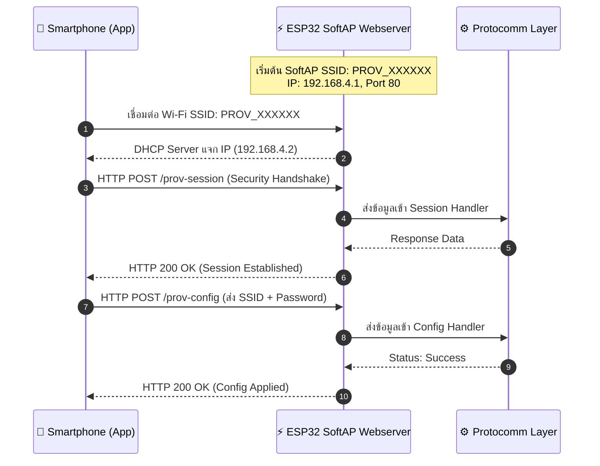
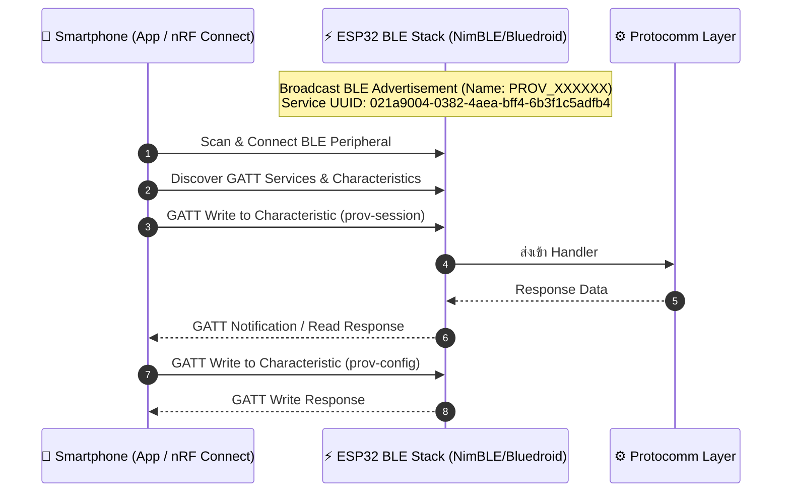

# 02 Transport Layer Comparison: SoftAP vs. BLE Scheme

## 1. บทนำ (Introduction)
ในการทำ Wi-Fi Provisioning ข้อมูลจะต้องถูกส่งผ่านสื่อสัญญาณไร้สายชั่วคราวระหว่าง Smartphone และ ESP32 โดย ESP-IDF มี Transport Scheme หลักให้เลือก 2 ชนิด ได้แก่
1. **Wi-Fi SoftAP Scheme (`wifi_prov_scheme_softap`)**  การ provision ผ่าน Wi-Fi
2. **Bluetooth Low Energy Scheme (`wifi_prov_scheme_ble`)**  การ provision ผ่าน BLE

การเลือกใช้ Scheme มีผลอย่างยิ่งต่อประสบการณ์ผู้ใช้งาน (User Experience - UX), ความต้องการทรัพยากรฮาร์ดแวร์ (Hardware/Memory Overhead), และรูปแบบการตรวจสอบความปลอดภัยเชิงนิติวิทยาศาสตร์ (Forensic Analysis)

---

## 2. ตารางเปรียบเทียบ SoftAP vs. BLE ในเชิงเทคนิค

| คุณลักษณะ (Attributes)              | SoftAP Scheme (`scheme_softap`)               | BLE Scheme (`scheme_ble`)                                    |
| :---------------------------------- | :-------------------------------------------- | :----------------------------------------------------------- |
| **ความเข้ากันได้ของฮาร์ดแวร์**      | ESP32, ESP32-S2 (ไม่มี BT), ESP8266           | ESP32, ESP32-C3, ESP32-S3, ESP32-C6                          |
| **โปรโตคอลในระดับ Network**         | IP / HTTP Server (เช่น `http://192.168.4.1/`) | Bluetooth GATT Profile (Services & Characteristics)          |
| **ประสบการณ์ผู้ใช้ (UX)**           | ผู้ใช้ต้องสลับ Wi-Fi บนมือถือมาต่อที่บอร์ด    | เชื่อมต่ออัตโนมัติเบื้องหลัง มือถือไม่ต้องหลุดจาก Wi-Fi เดิม |
| **การใช้หน่วยความจำ RAM**           | ใช้ RAM ปานกลาง (HTTP Server stack)           | ใช้ RAM สูงขณะ Provision (BLE Controller stack)              |
| **การคืนหน่วยความจำ (RAM Freeing)** | ปิด AP (`esp_wifi_set_mode(STA)`)             | คืน BT Memory ได้ทั้งหมด (`esp_bt_mem_release()`)            |
| **ความเร็วในการ Provisioning**      | ช้ากว่า (เสียเวลาตอนสลับ Wi-Fi Connection)    | รวดเร็วกว่า และลื่นไหลกว่ามาก                                |
| **Forensic Packet Sniffing**        | ใช้ Wi-Fi Sniffer ดักจับ HTTP POST Request    | ใช้ BLE Sniffer (เช่น Wireshark/nRF Sniffer) ส่อง GATT Write |

---

## 3. เจาะลึกกลไก SoftAP Transport Scheme

ในโหมด SoftAP, ESP32 จะเปิด **Embedded HTTP Webserver** ขึ้นมา และแมป Protocomm Endpoints เป็น HTTP URIs ภายใต้ IP เริ่มต้น `192.168.4.1`



### ลักษณะของ HTTP Request ในเชิง Forensic
- **HTTP Method** `POST`
- **Headers** `Content-Type: application/x-protobuf` หรือ `application/octet-stream`
- **Body** Binary Protobuf Payload ที่ถูกเข้ารหัส (หากเปิด Security 1 หรือ 2)

---

## 4. เจาะลึกกลไก BLE Transport Scheme

ในโหมด BLE, ESP32 จะทำงานเป็น **BLE Peripheral** และประกาศตัวผ่าน **Advertising Packets** โดยเปิด Generic Attribute Profile Service (GATT) พิเศษขึ้นมา ดังแผนผังต่อไปนี้



### โครงสร้าง GATT Service & Characteristic UUIDs
ESP-IDF ใช้ Base UUID 128-bit ที่ปรับแต่งได้ โดยกำหนดให้ Characteristic แต่ละตัวตรงกับ Endpoint ของ Protocomm

- **Base Service UUID (128-bit)**
  `021a9004-0382-4aea-bff4-6b3f1c5adfb4`
- **GATT Characteristics ภายใน Service**
  - `prov-session` (UUID: `0x...FF51`) - ใช้สำหรับ Handshake & Key Exchange
  - `prov-config` (UUID: `0x...FF52`) - ใช้สำหรับส่ง Credentials
  - `prov-scan` (UUID: `0x...FF53`) - ใช้สำหรับสแกน AP
  - `proto-ver` (UUID: `0x...FF54`) - ใช้ตรวจสอบเวอร์ชัน
  - `custom-data` (UUID: `0x...FF55`) - ใช้สำหรับ Custom Endpoint

> [!TIP]
> เราสามารถใช้แอป **nRF Connect for Mobile** ในการสแกนค้นหาบอร์ด ESP32 เพื่อดู Service UUID และค่า Descriptor `0x2901` (User Characteristic Description) ซึ่งจะแสดงชื่อ Endpoint ภาษาอังกฤษชัดเจน!

---

## 5. กลยุทธ์การบริหารจัดการหน่วยความจำ (RAM Freeing Strategy)

Bluetooth Stack บน ESP32 ใช้หน่วยความจำ RAM ค่อนข้างมาก (~40KB - 80KB ขึ้นอยู่กับการคอนฟิก) หากอุปกรณ์ของเราต้องการใช้ RAM สำหรับงานอื่นหลังจากต่อ Wi-Fi สำเร็จ ESP-IDF มีฟังก์ชันช่วยคืนหน่วยความจำทั้งหมด

```c
// คอนฟิกให้ Provisioning Manager ปล่อยหน่วยความจำ BT ทันทีเมื่อเสร็จสิ้น
config.scheme_event_handler = WIFI_PROV_SCHEME_BLE_EVENT_HANDLER_FREE_BTDM;
```

เมื่อกระบวนการ Provisioning จบลง ฟังก์ชัน `esp_bt_mem_release(ESP_BT_MODE_BTDM)` จะถูกเรียกโดยอัตโนมัติ ทำให้ระบบได้ RAM ก้อนใหญ่กลับคืนมาสำหรับใช้งาน Wi-Fi, MQTT หรือ TLS อย่างเต็มประสิทธิภาพ

---

## 6. สรุป
- **SoftAP** เหมาะสำหรับชิปที่ไม่มี Bluetooth (เช่น ESP32-S2) หรือต้องการความเรียบง่าย แต่มีข้อเสียเรื่อง UX ที่ผู้ใช้ต้องสลับเครือข่าย Wi-Fi
- **BLE** เป็นมาตรฐานหลักของอุปกรณ์ Commercial Smart Home (รวมถึงมาตรฐาน **Matter**) เพราะเชื่อมต่อง่าย รวดเร็ว และสามารถคืน RAM ได้สมบูรณ์หลังใช้งานเสร็จ
