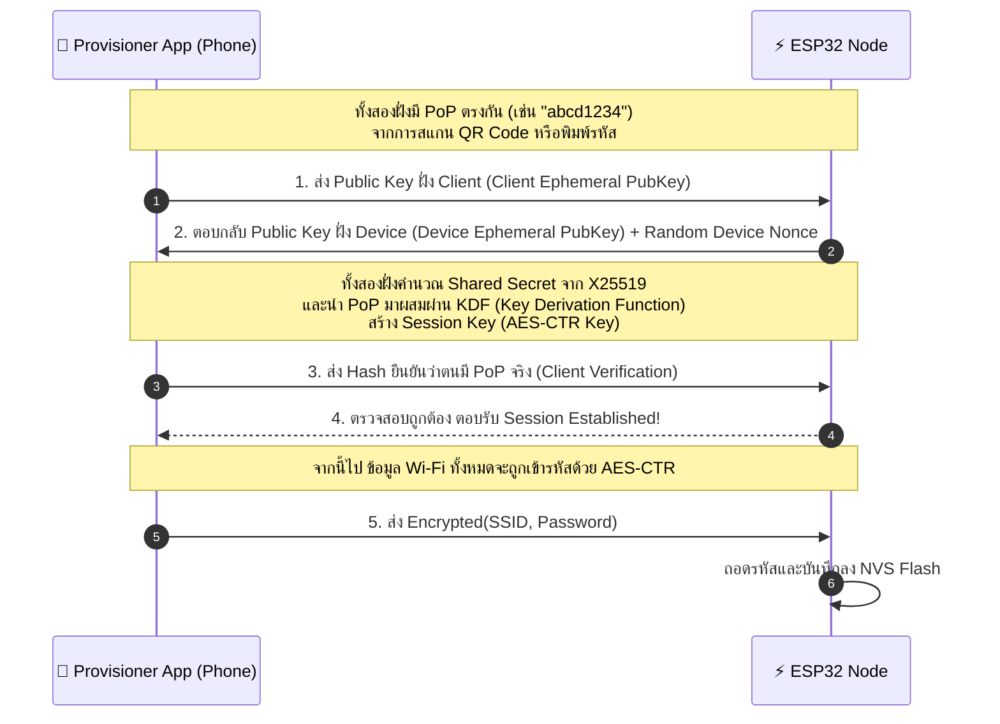
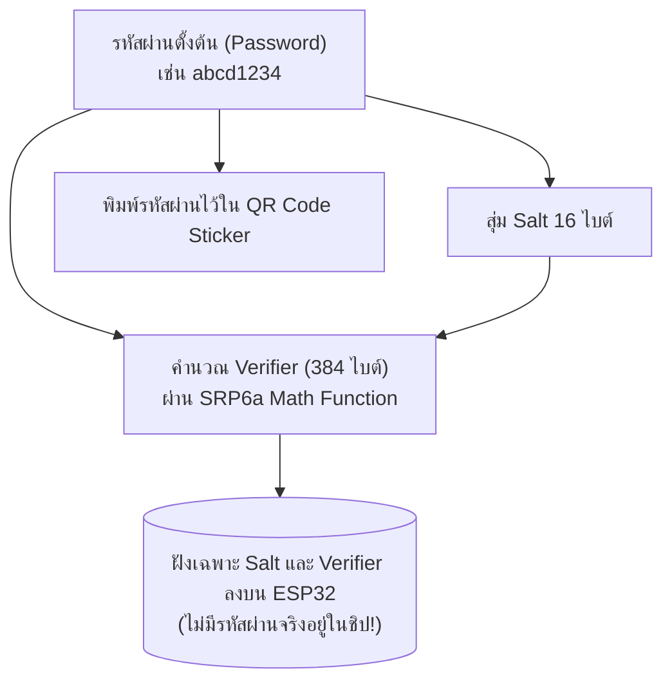

# 03 Provisioning Security Schemes & Cryptographic Analysis

## 1. บทนำ (Introduction)
ในกระบวนการ Wi-Fi Provisioning ข้อมูลสำคัญระดับความลับสูงสุดอย่าง **Wi-Fi SSID** และ **Wi-Fi Password (WPA2/WPA3 Pre-Shared Key)** จะต้องถูกส่งผ่านคลื่นวิทยุ (Over-The-Air: OTA)

หากไม่มีการเข้ารหัสที่ดี ผู้โจมตีที่อยู่ใกล้เคียงสามารถใช้เครื่องมือ Sniffer ดักจับคลื่นวิทยุเพื่อขโมยรหัสผ่าน Wi-Fi ของบ้านหรือองค์กร หรือส่งคำสั่งบิดเบือน (Rogue Provisioning) ยึดครองอุปกรณ์ IoT ได้ทันที

ESP-IDF จึงออกแบบ **Protocomm Security Schemes** ไว้ 3 ระดับ เพื่อรองรับสถานการณ์ที่แตกต่างกันดังแสดงในตารางต่อไปนี้

---

## 2. ตารางเปรียบเทียบระดับความปลอดภัย (Security Schemes 0, 1, 2)

| คุณสมบัติ (Features)                 | Security 0 (Sec0)              | Security 1 (Sec1)               | Security 2 (Sec2)                               |
| :----------------------------------- | :----------------------------- | :------------------------------ | :---------------------------------------------- |
| **ระดับความปลอดภัย**                 | ❌ ไม่มีความปลอดภัย (Plaintext) | 🛡️ ปานกลาง-สูง (AES-CTR + PoP) | 🔒 สูงสุด (SRP6a + AES-GCM)                     |
| **การแลกเปลี่ยนคีย์ (Key Exchange)** | ไม่มี                          | **X25519 (Curve25519 ECDH)**    | **SRP6a** (Secure Remote Password)              |
| **การเข้ารหัสข้อมูล (Encryption)**   | ไม่มี (ข้อความธรรมดา)          | **AES-CTR-128**                 | **AES-GCM-128** (Authenticated Enc.)            |
| **กลไกยืนยันตัวตน (Authentication)** | ไม่มี                          | **Proof-of-Possession (PoP)**   | **Username + Password (Verifier/Salt)**         |
| **ป้องกัน Eavesdropping (ดักฟัง)**   | ❌ ดักจับเห็นรหัสผ่านทันที      | ✅ ข้อมูลถูกเข้ารหัสทั้งหมด      | ✅ ข้อมูลถูกเข้ารหัสทั้งหมด                      |
| **ป้องกัน MITM Attack**              | ❌ ไม่สามารถป้องกันได้          | ✅ ป้องกันได้หากมี PoP           | ✅ ป้องกันได้สมบูรณ์ (Zero-Knowledge)            |
| **การเก็บความลับใน Firmware**        | ไม่มีการเก็บ                   | ฝัง PoP เป็น Hardcoded String   | ฝัง Salt และ SRP Verifier (ไม่เก็บรหัสผ่านจริง) |

---

## 3. เจาะลึก Security 1 (X25519 + AES-CTR + Proof-of-Possession)

Security 1 เป็นโหมดความปลอดภัยมาตรฐานที่นิยมใช้งานอย่างแพร่หลายในอุปกรณ์ ESP32



### Proof-of-Possession (PoP) คืออะไร?
**Proof-of-Possession (PoP)** คือรหัสลับเฉพาะเครื่อง (มักพิมพ์เป็นตัวเลข/ตัวอักษร 8-12 ตัวบนสติ๊กเกอร์ หรือฝังอยู่ใน QR Code) 
* **วัตถุประสงค์** เพื่อยืนยันว่าผู้ที่กำลังสั่ง Provisioning คือคนที่ถืออุปกรณ์อยู่จริง (Physical Possession) ไม่ใช่ผู้โจมตีข้างบ้านที่แอบสั่ง Provision ผ่านสัญญาณบลูทูธระยะไกล

---

## 4. เจาะลึก Security 2 (SRP6a + AES-GCM)

Security 2 อิงตามมาตรฐาน **SRP6a (Secure Remote Password Protocol - RFC 5054)** ซึ่งเป็นโปรโตคอลการพิสูจน์ตัวตนแบบ **Zero-Knowledge Proof (ZKP)**



### ข้อได้เปรียบทางด้าน Forensic & Security ของ Sec2
1. **No Plaintext Password in Flash** แม้ผู้โจมตีจะถอดชิป Flash ออกมา Dump ข้อมูล ก็จะไม่พบรหัสผ่าน (พบเพียง Salt และ Verifier ทางคณิตศาสตร์)
2. **Authenticated Encryption (AES-GCM)** มี Integrity Check ป้องกันการแก้ไขเปลี่ยนแปลงข้อมูลแม้แต่บิตเดียว
3. **ป้องกัน Brute-Force & Dictionary Attacks** โครงสร้างทางคณิตศาสตร์ของ SRP ป้องกันการเดารหัสผ่านแบบ Offline

---

## 5. การสร้าง QR Code Payload

ESP-IDF จัดเตรียมฟังก์ชันสร้าง QR Code Payload ในรูปแบบ JSON ซึ่งจะรวมชื่ออุปกรณ์, รูปแบบ Transport และ PoP ไว้ด้วยกัน

```json
{
  "ver": "v1",
  "name": "PROV_0ED054",
  "pop": "abcd1234",
  "transport": "ble"
}
```

เมื่อผู้ใช้ใช้แอป **ESP BLE Provisioning** สแกน QR Code นี้ แอปจะดึงค่า `pop` ไปใช้สร้าง Security Session อัตโนมัติโดยที่ผู้ใช้ไม่ต้องพิมพ์เอง

---

## 6. สรุป
- **Security 0** เหมาะสำหรับห้องทดลองและทำความเข้าใจโครงสร้าง Packet เบื้องต้น (ห้ามใช้ในผลิตภัณฑ์จริงเด็ดขาด)
- **Security 1** สมดุลระหว่างความปลอดภัยและทรัพยากรการคำนวณ เหมาะสำหรับ Commercial IoT ทั่วไป
- **Security 2** ความปลอดภัยระดับสูงสุด ป้องกันการแฮก Hardware Flash Dump เหมาะสำหรับอุปกรณ์เกรดอุตสาหกรรมและการเงิน
