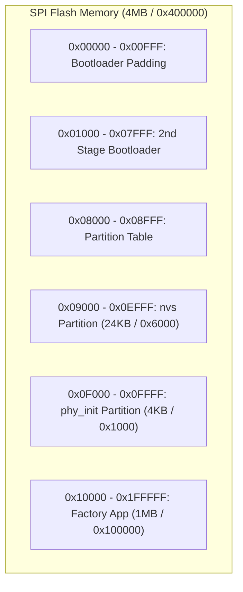
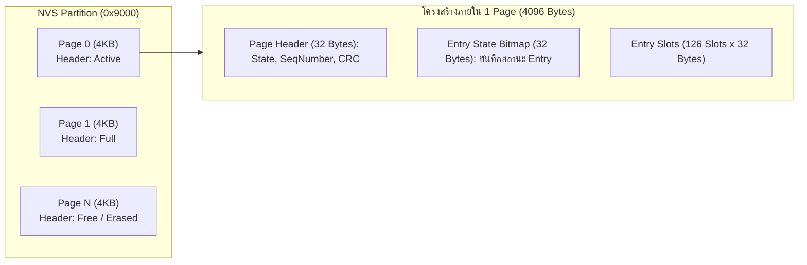

# 04 Flash Memory Architecture & NVS Forensic Inspection

## 1. บทนำ (Introduction)
เมื่อกระบวนการ Wi-Fi Provisioning เสร็จสมบูรณ์ ข้อมูลการเชื่อมต่อ (Wi-Fi SSID, Password, Security Keys) จะถูกบันทึกไว้อย่างถาวรใน **NVS (Non-Volatile Storage)** ซึ่งเป็นพื้นที่ในชิป SPI Flash Memory ของ ESP32 เพื่อให้อุปกรณ์สามารถต่อ Wi-Fi ได้ทันทีเมื่อเปิดเครื่องใหม่โดยไม่ต้องทำ Provisioning ซ้ำ

ในบทเรียนนี้ เราจะทำการศึกษาเชิง **Hardware & Memory Forensics** เพื่อทำความเข้าใจ
1. การจัดสรร Partition Table ใน Flash Memory
2. โครงสร้างภายในของ NVS Partition (Pages, Entries, Namespaces, Keys)
3. เครื่องมือและเทคนิคการ Dump ข้อมูล Flash ออกมาตรวจสอบ
4. ผลกระทบของคำสั่ง Reset แต่ละรูปแบบต่อข้อมูลใน Flash

---

## 2. แผนผัง Flash Memory & Partition Table

โดยทั่วไป โครงสร้าง Partition ของ ESP32 จะถูกนิยามไว้ในไฟล์ `partitions.csv`



### การตรวจสอบจาก Bootloader Log
```text
I (49) boot: Partition Table:
I (51) boot: ## Label      Usage        Type ST Offset   Length
I (58) boot:  0 nvs        WiFi data      01 02 00009000 00006000
I (64) boot:  1 phy_init   RF data        01 01 0000f000 00001000
I (71) boot:  2 factory    factory app    00 00 00010000 00100000
```
- Partition `nvs` อยู่ที่ Offset **`0x9000`** และมีความยาว **`0x6000`** (24 KB = 6 Flash Pages ขนาดหน้าละ 4KB)

---

## 3. โครงสร้างภายในของ NVS Partition

NVS ถูกออกแบบให้เป็นระบบ **Key-Value Store** ที่ทนทานต่อไฟดับกะทันหัน (Power-cut resilient) และมีการทำ Wear-Leveling ภายใน


### รายละเอียดของแต่ละ Entry Slot (32 ไบต์):
- **Namespace Index (1 Byte)** กลุ่มข้อมูล เช่น `nvs.net80211`, `custom_cfg`
- **Type (1 Byte)** ชนิดข้อมูล (`U8`, `I32`, `STR`, `BLOB`)
- **Span (1 Byte)** จำนวนสล็อตที่ใช้ต่อเนื่อง (สำหรับ String หรือ Blob ขนาดยาว)
- **Key Name (16 Bytes)** ชื่อ Key เช่น `sta.ssid`, `sta.pswd`, `sta.authmode`
- **Data / Payload (8 Bytes)** ค่าข้อมูลจริง หรือ Hash/Pointer

---

## 4. การดึงข้อมูล Flash ออกมาตรวจสอบ (Forensic Dump)

เราสามารถใช้เครื่องมือ `esptool.py` ทำการดูด (Read) ข้อมูล Raw Binary จากชิป Flash ออกมายังเครื่องคอมพิวเตอร์เพื่อทำการสืบสวน

### คำสั่ง Dump เฉพาะ Partition NVS (0x9000, ขนาด 0x6000):
```powershell
esptool.py -p COMxx -b 921600 read_flash 0x9000 0x6000 nvs_dump.bin
```

### การตรวจสอบด้วย Hex Editor / Strings
เมื่อเปิดไฟล์ `nvs_dump.bin` ด้วย Hex Editor หรือรันคำสั่ง `strings` เราจะพบข้อความ SSID และรหัสผ่านที่ถูกบันทึกไว้

```text
Offset 0x00000100:  ... nvs.net80211 ... sta.ssid ... MyHomeWiFi_5G ...
Offset 0x00000140:  ... sta.pswd ... Password1234! ...
```

> [!WARNING]
> **ข้อพึงระวังด้านความปลอดภัย:** หากไม่มีการเปิดใช้งาน **Flash Encryption (AES-XTS)** หรือ NVS Encryption ผู้ที่มีการเข้าถึงตัวอุปกรณ์ทางกายภาพ (Physical Access) สามารถใช้สาย Serial ดึงรหัสผ่าน Wi-Fi ออกมาได้ทั้งหมด!

---

## 5. เปรียบเทียบผลลัพธ์ของ 3 รูปแบบ ในการ Reset ต่อ Flash Memory (มีรายละเอียดในใบงาน)

| รูปแบบการ Reset                     | วิธีดำเนินการ                           | ผลกระทบต่อ Flash Memory                                                                    | สถานะการกู้คืนข้อมูล                                                              |
| :---------------------------------- | :-------------------------------------- | :----------------------------------------------------------------------------------------- | :-------------------------------------------------------------------------------- |
| **1. CLI Full Erase**               | `idf.py erase-flash`                    | ล้างทุกเซกเตอร์ใน Flash เป็น `0xFF` ทั้งหมด (Bootloader, Partition Table, NVS, App หายหมด) | ❌ กู้คืนไม่ได้ ต้อง Flash โค้ดใหม่                                                |
| **2. CLI Partition Erase**          | `esptool.py erase_region 0x9000 0x6000` | ลบเฉพาะ Partition `nvs` เป็น `0xFF` แต่เฟิร์มแวร์ Application ยังคงอยู่                    | ❌ กู้คืนไม่ได้ (NVS ถูกลบเกลี้ยง)                                                 |
| **3. Menuconfig Flag / Code Reset** | `wifi_prov_mgr_reset_provisioning()`    | ส่งคำสั่งลบเฉพาะ Key ที่เกี่ยวข้องกับ Wi-Fi ใน Namespace `nvs.net80211`                    | ⚠️ อาจยังมีข้อมูลเก่าค้างใน Erased Entry (ถ้ายังไม่เกิด Flash Garbage Collection) |
| **4. Hardware Button Reset**        | กดปุ่ม BOOT ค้างตอนเปิดเครื่อง          | เรียก `nvs_flash_erase()` หรือ `wifi_prov_mgr_reset_provisioning()` ทางซอฟต์แวร์           | ขึ้นอยู่กับฟังก์ชันที่เลือกใช้                                                    |

---

## 6. สรุป
ความเข้าใจเรื่อง NVS Flash ไม่เพียงแต่ช่วยให้เราเข้าใจการทำงานของ Wi-Fi Provisioning Manager เท่านั้น แต่ยังเป็นพื้นฐานสำคัญในการตรวจสอบช่องโหว่ความปลอดภัย (Security Audit) และการออกแบบระบบ Factory Reset ที่ปลอดภัยสำหรับผลิตภัณฑ์ IoT
